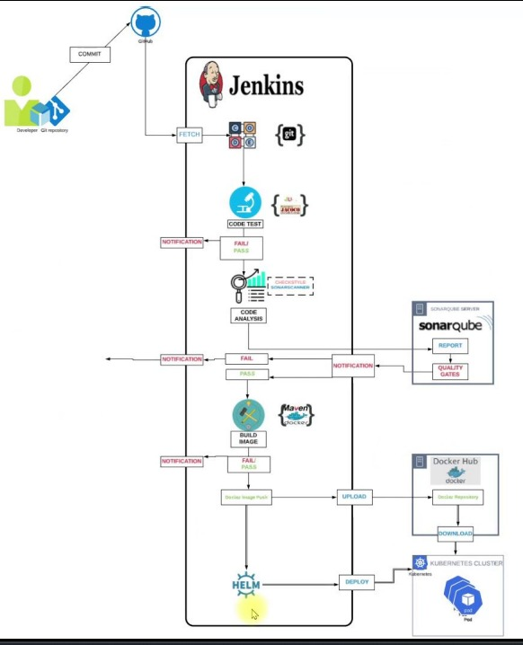

# CICD-Kube-Docker

> Automating CI/CD with Kubernetes, Docker, and Helm.

---

## Table of Contents

- [Project Overview](#project-overview)
- [Workflow](#workflow)
- [Benefits](#benefits)
- [Getting Started](#getting-started)

---

## Project Overview

This repository contains the code and configurations for an automated CI/CD pipeline that deploys a Java application to a Kubernetes cluster using Docker and Helm. The pipeline automates the entire process, from code commits to deployment, with a focus on maintaining code quality and scalability.

---

## Workflow

1. **Code Changes**:
   - Developers commit changes to the code repository.

2. **Build and Test**:
   - Jenkins detects new commits and triggers a build job.
   - The build job:
     - Clones the code repository.
     - Builds the software.
     - Runs unit tests.

3. **Code Quality Analysis**:
   - If unit tests pass, the build job performs a code quality analysis using SonarQube.

4. **Docker Image**:
   - If the code quality analysis passes:
     - The build job builds a Docker image of the software.
     - The Docker image is pushed to Docker Hub.

5. **Deployment to Kubernetes**:
   - Jenkins deploys the Docker image to a Kubernetes cluster using Helm.
   - The application is now accessible to users.

---

## Benefits

- **Automation**: The workflow automates the entire build, test, and deployment process, saving developers time and reducing the risk of errors.

- **Code Quality**: Integration of code quality analysis ensures high-quality software.

- **Scalability**: The use of containers and Kubernetes makes the deployment scalable and portable.

---

## Getting Started

Follow these steps to set up and run the CI/CD pipeline:

1. **Prerequisites**:
   - Ensure you have Jenkins, SonarQube, Docker, Kubernetes, and Helm installed and configured.

2. **Configuration**:
   - Configure Jenkins to trigger builds on code commits.
   - Set up SonarQube for code quality analysis.

3. **Docker Hub**:
   - Set up a Docker Hub repository for storing Docker images.

4. **Kubernetes Cluster**:
   - Configure your Kubernetes cluster and Helm.

5. **Pipeline Configuration**:
   - Adjust pipeline configuration files to match your project's specifics.

6. **Run the Pipeline**:
   - Trigger a build in Jenkins to initiate the CI/CD pipeline.

