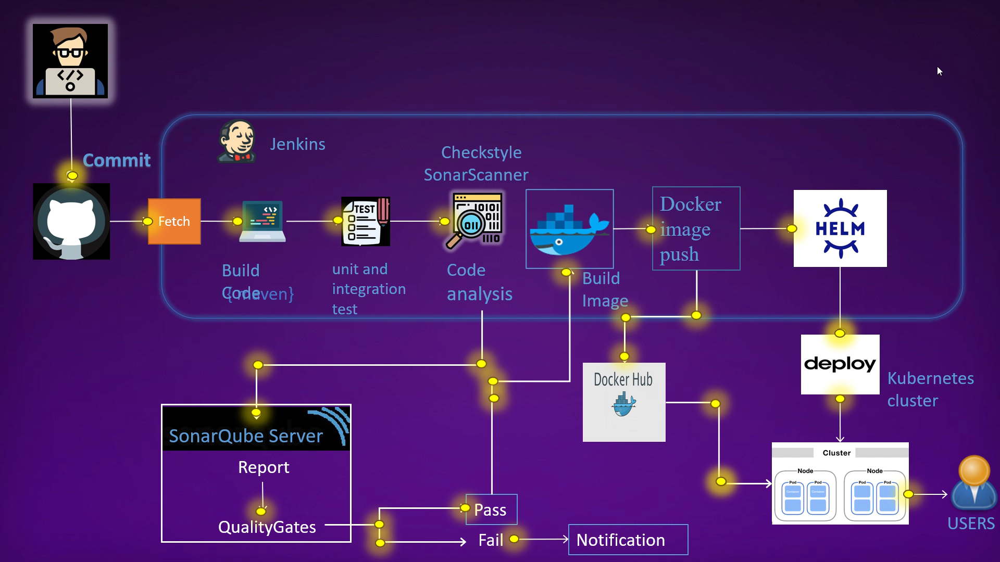
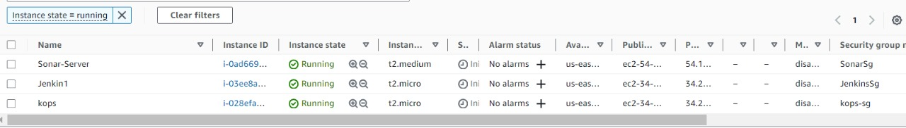
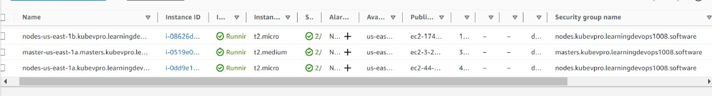
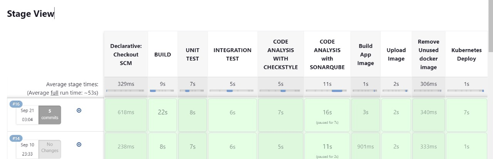
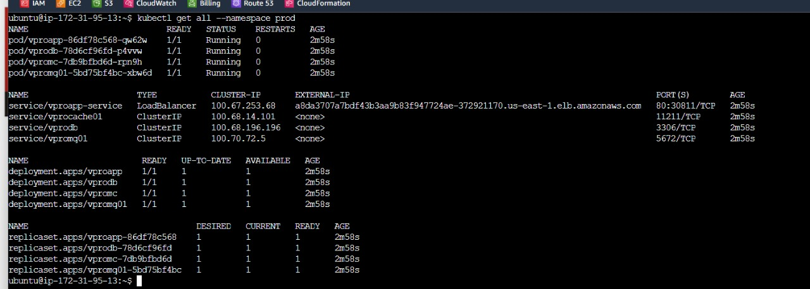

# CICD-Kube-Docker

[](http://www.youtube.com/watch?v=FHX3ZA4RPrw)

> Automating CI/CD with Kubernetes, Docker, and Helm.

---

## Table of Contents

- [Introduction](#introduction)
- [Workflow](#workflow)
- [AWS Infrastructure Setup](#aws-infrastructure-setup)
- [Setup of All Three Instances](#setup-of-all-three-instances)
- [Pipeline Configuration and Plugin Integration](#pipeline-configuration-and-plugin-integration)
- [Testing the Pipeline](#testing-the-pipeline)

---

## Introduction

This repository contains the code and configurations for an automated CI/CD pipeline that deploys a Java application to a Kubernetes cluster using Docker, Kops, and Helm. The pipeline automates the entire process, from code commits to deployment, with a focus on maintaining code quality and scalability.

---

## Workflow

1. **Code Changes**:
   - Developers commit changes to the code repository.

2. **Build and Test**:
   - Jenkins detects new commits and triggers a build job.
   - The build job:
     - Clones the code repository.
     - Builds the software.
     - Runs unit tests.

3. **Code Quality Analysis**:
   - If unit tests pass, the build job performs a code quality analysis using SonarQube.

4. **Docker Image**:
   - If the code quality analysis passes:
     - The build job builds a Docker image of the software.
     - The Docker image is pushed to Docker Hub.

5. **Deployment to Kubernetes**:
   - Jenkins deploys the Docker image to a Kubernetes cluster using Helm.
   - The application is now accessible to users.

---

## AWS Infrastructure Setup

- **Jenkins Instance**:
  - Serves as the heart of our CI/CD operations. Jenkins automates the build and deployment processes and orchestrates the entire pipeline.

- **Kops Instance**:
  - Manages our Kubernetes cluster. It provides a hassle-free way to deploy, upgrade, and maintain production-ready Kubernetes clusters.

- **SonarQube Instance**:
  - Maintains code quality and ensures our applications are in peak condition. It scrutinizes code, identifies issues, and enhances overall software quality.



---

## Setup of All Three Instances

### Jenkins Server

- Install openJDk and Jenkins on the instance.
- Enable the Jenkins service.
- Access Jenkins at `http://<your_server_ip>:8080`.
- Initial admin password is located at `/var/lib/jenkins/secrets/initialAdminPassword`.

### Plugin Integration

Jenkins provides a rich ecosystem of plugins that enhance its functionality. Here are some of the crucial plugins used in this project:

- **SonarQube Scanner**: Enables seamless integration with SonarQube for code quality analysis.
- **Pipeline Maven Integration**: Streamlines the integration of Apache Maven, a powerful project management and comprehension tool.
- **Build Timestamp**: Allows you to timestamp your builds, aiding in versioning and tracking.
- **Docker**: Simplifies the integration of Docker, making it easy to build and push Docker images.



### Kops Server

- Install Kops, kubectl, and helm chart.
- Create a Kops slave node in Jenkins following the below steps:
  - Make directory `Jenkins-slave`.
  - `sudo apt install OpenJDK-11-jdk -y`
  - `sudo mkdir /opt/jenkins-slave`
  - `sudo chown ubuntu.ubuntu /opt/Jenkins-slave -R`
- Add a new node named `kops` in Jenkins remote root directory `/opt/Jenkins-slave` with the private IP of kops instance (e.g., `172.1.3.1`).
- Create new credential with ID `kops`:
  - Login username: `ubuntu`
  - Use `kops.pem` with SSH public key.



As you can see, we have created 1 master and 2 worker nodes in our cluster. Run `kubectl create namespace Prod` where we will run helm charts with Jenkins.

### Sonarqube Server

- Use the [provided script](https://github.com/DIVYANSH856/cicd-kube-docker/blob/main/SonarQube_Script.sh) to automate the setup of SonarQube on an Ubuntu server.
- This script includes adjusting system parameters, installing OpenJDK 11, configuring PostgreSQL, downloading and setting up SonarQube, creating a systemd service, configuring Nginx as a reverse proxy, opening necessary ports, and initiating a system reboot.
- Default username and password will be `admin`.



---
## Pipeline Configuration and Plugin Integration with plugins
The Jenkinsfile, residing in our project repository, defines the pipeline stages and plugin integration. Key stages include building, testing, code analysis, Docker image creation, Kubernetes deployment, and more.

```groovy
pipeline {
    agent any
    environment {
        registry = "divyanshkohli856/vprofileappdock"
        registryCredentials = 'dockerhub'
    }
    stages {
        stage('BUILD') {
            steps {
                sh 'mvn clean install -DskipTests'
            }
            post {
                success {
                    echo 'Now Archiving...'
                    archiveArtifacts artifacts: '**/target/*.war'
                }
            }
        }
        stage('UNIT TEST') {
            steps {
                sh 'mvn test'
            }
        }
        stage('INTEGRATION TEST') {
            steps {
                sh 'mvn verify -DskipTests'
            }
        }
        stage('CODE ANALYSIS WITH CHECKSTYLE') {
            steps {
                sh 'mvn checkstyle:checkstyle'
            }
            post {
                success {
                    echo 'Generated Analysis Result'
                } }
        }
        stage('CODE ANALYSIS with SONARQUBE') {
            environment {
                scannerHome = tool 'sonar4.4.0.2170'
            }
            steps {
                withSonarQubeEnv('sonar-pro') {
                    sh """${scannerHome}/bin/sonar-scanner -Dsonar.projectKey=vprofile \
                       -Dsonar.projectName=vprofile-repo \
                       -Dsonar.projectVersion=1.0 \
                       -Dsonar.sources=src/ \
                       -Dsonar.java.binaries=target/test-classes/com/visualpathit/account/controllerTest/ \
                       -Dsonar.junit.reportsPath=target/surefire-reports/ \
                       -Dsonar.jacoco.reportsPath=target/jacoco.exec \
                       -Dsonar.java.checkstyle.reportPaths=target/checkstyle-result.xml"""
                }
                timeout(time: 5, unit: 'MINUTES') {
                    waitForQualityGate abortPipeline: true
                }//used webhook 
            }
        }
        stage('Build App Image') {
            steps {
                script {
                    dockerImage = docker.build("${registry}:V${BUILD_NUMBER}")
                }
            }
        }
        stage('Upload Image') {
            steps {
                script {
                    docker.withRegistry('', registryCredentials) {
                        dockerImage.push()
                        dockerImage.push('latest')
                    }
                }
            }
        }
        stage('Remove Unused docker image') {
            steps {
                sh "docker rmi ${registry}:V${BUILD_NUMBER}"
            }
        }
        stage('Kubernetes Deploy') {
            agent { label 'KOPS' }
            steps {
                sh "helm upgrade --install --force vprofile-stack helm/vprofilecharts --set appimage=${registry}:V${BUILD_NUMBER} --namespace prod"
            }
        }
    }
}
```
## Jenkinsfile Configuration

this is our Jenkinsfile which will be placed in our project repository .This comprehensive setup ensures a seamless, automated CI/CD pipeline that maintains code quality and scalability throughout the development process.


### Pipeline Stages

1. **BUILD**:
   - This stage builds the project, excluding tests, ensuring a clean package for further processing.

2. **UNIT TEST**:
   - Executes unit tests to validate the functionality of the code.

3. **INTEGRATION TEST**:
   - Runs integration tests to ensure different parts of the system work together as expected.

4. **CODE ANALYSIS WITH CHECKSTYLE**:
   - Performs code analysis using Checkstyle to maintain code quality and adherence to coding standards.

5. **CODE ANALYSIS WITH SONARQUBE**:
   - Utilizes SonarQube for in-depth code analysis, covering areas like code duplications, maintainability, reliability, and security.

6. **Build App Image**:
   - Builds a Docker image of the application for containerization.

7. **Upload Image**:
   - Pushes the Docker image to Docker Hub for easy access and deployment.

8. **Remove Unused Docker Image**:
   - Cleans up any unnecessary Docker images to optimize resources.

9. **Kubernetes Deploy**:
   - Deploys the application to the Kubernetes cluster using Helm, ensuring seamless and consistent deployments.

### Plugin Integration

We've integrated essential plugins like SonarQube Scanner, Pipeline Maven Integration, Build Timestamp, and Docker to enhance Jenkins' capabilities.

## Kubernetes Deployment

In the Kubernetes deployment stage, we specify an agent as 'Kops', which was created earlier. This ensures the deployment is carried out in the appropriate environment.

## Setting Up a New Pipeline

1. In the Jenkins pipeline configuration, locate the "Pipeline" section.

2. Under "Definition," select "Pipeline script from SCM."

3. In the "SCM" dropdown, choose "Git."

4. Provide the Git repository URL containing your Jenkinsfile. This is where your project's code is hosted.

5. Save the pipeline configuration.

## Triggering a Build

Manually trigger a build to ensure that everything is set up correctly. This step allows us to verify that the pipeline can successfully build, test, and deploy the application. If any issues arise during the build process, we can investigate and make necessary adjustments to the pipeline configuration.

## Testing the Pipeline

With the pipeline successfully in action, it's crucial to confirm that Helm has deployed our application to the Kubernetes cluster. Take a closer look at the deployment to ensure it meets expectations.

## Deployment

- Our pipeline has effectively created and started pods and services. Additionally, we've acquired a LoadBalancer external IP, allowing users to access our deployed Tomcat application. Simply navigate to http://YOUR_LOAD_BALANCER_EXTERNAL_IP to interact with the freshly deployed application.
---
